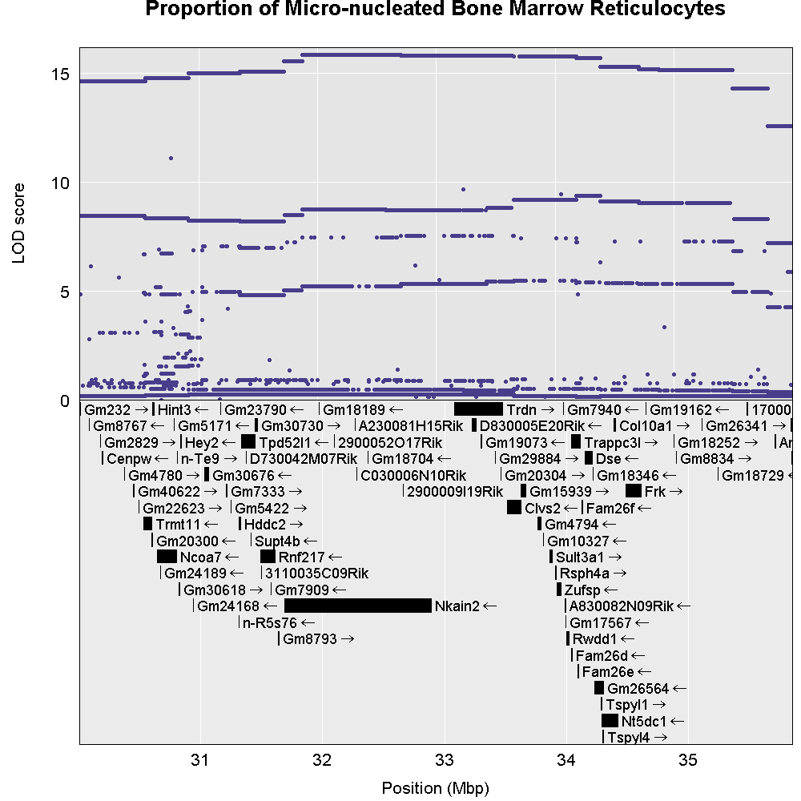
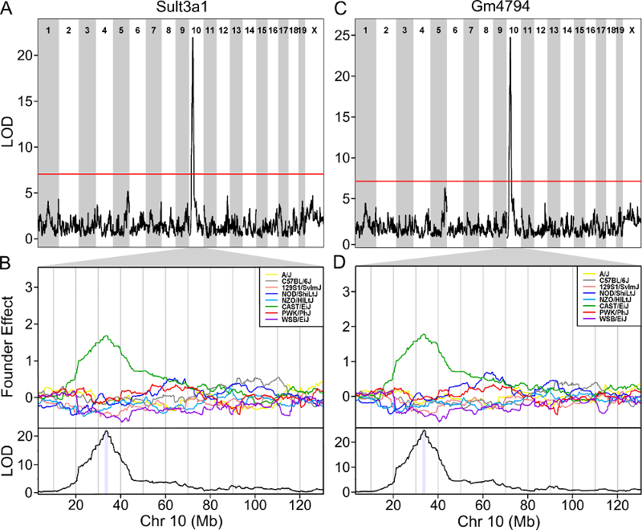
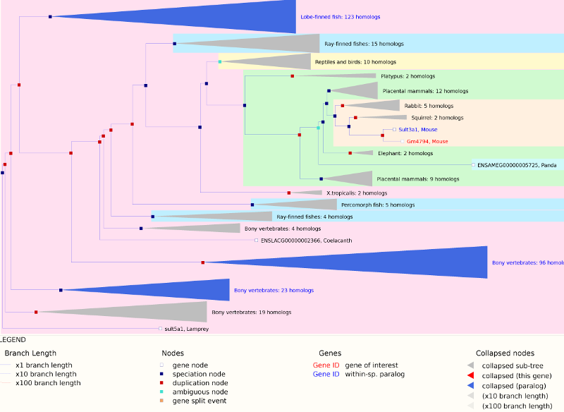
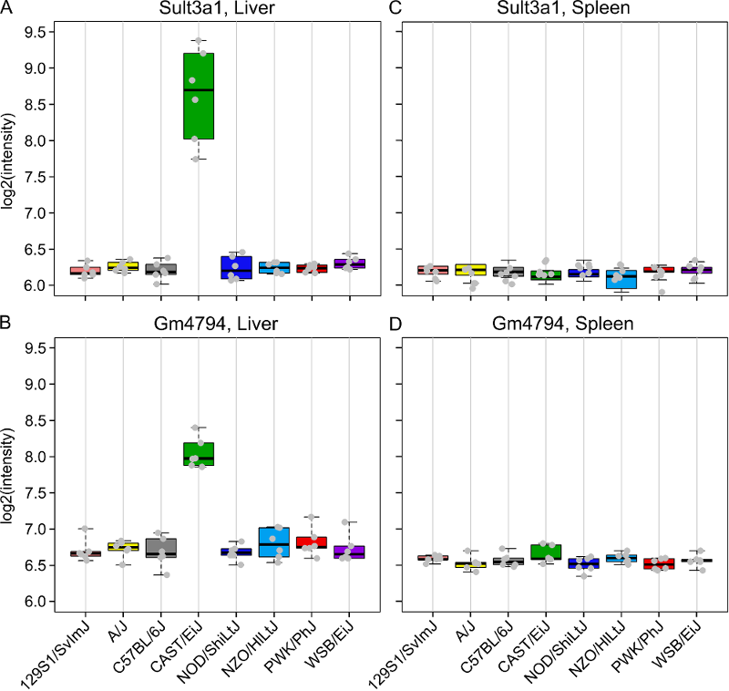

This tutorial will take you through the process of mapping a QTL and searching for candidate genes.

The data comes from a toxicology study in which mice were exposed to benzene via inhalation for 6 hours a day, 5 days a week for 4 weeks. The study was conducted in two equally sized cohort of 300 male mice each, for a total of 600 mice. They were then sacrificed and reticulocytes (red blood cell precursors) were isolated from bone marrow. The number of micro-nucleated reticulocytes, a measure of DNA damage, was then measured in each mouse. The goal is to map gene(s) that influence the level of DNA damage in the bone marrow.

### Loading the data

The data for this tutorial has been saved as an R binary file that contains several data objects.  Load it in now by running the following command.

~~~
library(qtl2)
library(qtl2convert)
library(qtl2db)
load(url("ftp://ftp.jax.org/dgatti/MDIBL_Aging2016/DOQTL_demo.Rdata"))
~~~
{: .r}

This loaded in two data objects. Look in the Environment pane to see what was loaded.  You should see an object called `pheno` with 143 rows and 5 columns and an object called `probs`.

`pheno` is a data frame containing the phenotype data. `probs` is a 3 dimensional array containing the founder allele dosages for each sample at each marker on the array.  Double-click on `pheno` in the Environment pane to view its contents.

**NOTE:** the sample IDs must be in the rownames of `pheno`.

It contains the sample ID, the study cohort, the dose of benzene and the proportion of bone marrow reticulocytes that were micro-nucleated (prop.bm.MN.RET).  Note that the sample IDs are also stored in the rownames of pheno. In order to save time for this tutorial, we will only map with 143 samples from the 100 ppm dosing group.

Next, we look at the contents of `probs`:

~~~
dim(probs)
~~~
{: .r}

~~~
[1]  143    8 7654
~~~
{: .output}

`probs` is a three dimensional array containing the proportion of each founder haplotype at each marker for each DO sample.  The 143 samples are in the first dimension, the 8 founders in the second and the markers along the mouse genome are in the third dimension. Let's look at the contents for the first 500 markers of one sample.

**NOTE:** the sample IDs must be in the rownames of `probs`.

~~~
image(1:500, 1:ncol(probs), t(probs[1,8:1,1:500]), breaks = 0:100/100,
      col = grey(99:0/100), axes = F, xlab = "Markers", ylab = "Founders",
      main = "Founder Allele Contributions for Sample 1")
abline(h = 0:8 + 0.5, col = "grey70")
usr = par("usr")
rect(usr[1], usr[3], usr[2], usr[4])
axis(side = 1, at = 0:5 * 100, labels = 0:5 * 100)
axis(side = 2, at = 1:8, labels = LETTERS[8:1], las = 1, tick = F)
~~~
{: .r}

In the plot above, the founder contributions, which range between 0 and 1, are colored from white (= 0) to black (= 1.0). A value of ~0.5 is grey. The markers are on the X-axis and the eight founders (denoted by the letters A through H) on the Y-axis. Starting at the left, we see that this sample has genotype CD because both rows C and D are grey, indicating values of 0.5 for each one. Moving along the genome to the right, the genotype becomes DD where row D is black, then CD, AC, CH, CD, CH, etc. The values at each marker sum to 1.0.

### QTL Mapping

First, we need the locations of the markers on the genotyping array. The array is called the Mouse Universal Genotyping Array (MUGA) and contain 7,856 SNP markers. Their locations are on [The Jackson Laboratory's FTP site](ftp://ftp.jax.org/MUGA):

~~~
load(url("ftp://ftp.jax.org/MUGA/muga_snps.Rdata"))
~~~
{: .r}

This loaded an object called `muga_snps` into your R environment. Look at it's structure in the Environment tab in RStudio.

We used a subset of the markers to reconstruct the DO genomes. We need to subset the markers so that they match the haplotype probabilities.

~~~
muga_snps = muga_snps[dimnames(probs)[[3]],]
stopifnot(rownames(muga_snps) == dimnames(probs)[[3]])
~~~
{: .r}

Convert the genotype probabilities from DOQTL format to qtl2 format. Convert the SNPs to a qtl2 map object.

~~~
genoprobs = probs_doqtl_to_qtl2(probs = probs, map = muga_snps, pos_column="pos")
map = map_df_to_list(map = muga_snps, pos_column="pos")
~~~
{: .r}

Next, we need to create a matrix that accounts for the kinship relationships between the mice. We do this by looking at the correlation between the founder haplotypes for each sample at each SNP. For each chromosome, we create a kinship matrix using all markers *except* the ones on the current chromosome. Simulations suggest that mapping using this approach increases the power to detect QTL.
           

~~~
K = calc_kinship(probs = genoprobs, type = "loco", use_allele_probs = TRUE)
~~~
{: .r}

Kinship values between pairs of samples range between 0 (no relationship) and 1.0 (completely identical). Let's look at the kinship matrix.

~~~
image(1:nrow(K[[1]]), 1:ncol(K[[1]]), K[[1]][,ncol(K[[1]]):1], xlab = "Samples", 
      ylab = "Samples", yaxt = "n", main = "Kinship between samples", 
      breaks = 0:100/100, col = heat.colors(length(0:100) - 1))
axis(side = 2, at = 20 * 0:7, labels = 20 * 7:0, las = 1)
~~~
{: .r}

The figure above shows kinship between all pairs of samples. White (= 1) indicates no kinship and red (= 0) indicates full kinship. Orange values indicate varying levels of kinship between 0 and 1. The white diagonal of the matrix indicates that each sample is identical to itself. The lighter yellow blocks off of the diagonal may indicate siblings or cousins.

Next, we need to create additive covariates that wil be used in the mapping model. We will use study cohort as a covariate in the mapping model. This study contained only male mice, but in most cases, you would include sex as an additive covariate as well.

~~~
addcovar = model.matrix(~Study, data = pheno)[,1, drop = FALSE]
~~~
{: .r}

The code above copies the `rownames(pheno)` to `rownames(addcovar)` as a side-effect of the `model.matrix` function..

**NOTE:** the sample IDs must be in the rownames of `pheno`, `addcovar`, `genoprobs` and `K`. qtl2 uses the sample IDs to align the samples between objects.

In order to map the proportion of bone marrow reticulocytes that were micro-nucleated, you will use the `scan1` function. To see the arguments for `scan1`, you can type `help(scan1)`.

~~~
pheno.column = which(colnames(pheno) == "prop.bm.MN.RET")
qtl = scan1(genoprobs = genoprobs, pheno = pheno[,pheno.column, drop = FALSE], kinship = K, addcovar = addcovar)
~~~
{: .r}

We can then plot the QTL scan. Note that you must provide the marker map.

~~~
plot(qtl, map, main = "Proportion of Micro-nucleated Bone Marrow Reticulocytes")
~~~
{: .r}

There is clearly a large peak on Chr 10. Next, we must assess its statistical significance. This is most commonly done via [permutation](http://www.genetics.org/content/178/1/609.long). We advise running at least 1,000 permutations to obtain significance thresholds. In the interest of time, we perform 100 permutations here.

~~~
perms = scan1perm(genoprobs = genoprobs, pheno = pheno[,"prop.bm.MN.RET", drop = FALSE], kinship = K, addcovar = addcovar, n_perm = 100)
~~~
{: .r}

The `perms` object contains the maximum LOD score from each genome scan of permuted data. The 

We can now add thresholds to the previous QTL plot. We use a significance threshold of p < 0.05. To do this, we select the 95th percentile of the permutation LOD distribution.
           

~~~
plot(qtl, map,  main = "Proportion of Micro-nucleated Bone Marrow Reticulocytes")
thr = quantile(perms, 0.95)
abline(h = thr, col = "red", lwd = 2)
~~~
{: .r}

The peak on Chr 10 is well above the red significance line.

We can find all of the peaks above the significance threshold using the `find_peaks` function.

~~~
find_peaks(qtl, map, threshold = thr)
~~~
{: .r}

~~~
  lodindex      lodcolumn chr      pos      lod
1        1 prop.bm.MN.RET  10 34.17711 16.53619
~~~
{: .output}

The support interval is determined using the [Bayesian Credible Interval](http://www.ncbi.nlm.nih.gov/pubmed/11560912) and represents the region most likely to contain the causative polymorphism(s). We can obtain this interval using the `bayesint` function.  We can determine the support interval for the QTL peak using the `bayes_int` function.

~~~
bayes_int(qtl, map, chr = 10)
~~~
{: .r}

~~~
     ci_lo      pos    ci_hi
1 30.16649 34.17711 35.49352
~~~
{: .output}

From the output above, you can see that the support interval is 5.5 Mb wide (30.16649 to 35.49352 Mb). The location of the maximum LOD score is 34.17711 Mb.

We will now zoom in on Chr 10 and look at the contribution of each of the eight founder alleles to the proportion of bone marrow reticulocytes that were micro-nucleated. The mapping model fits a term for each of the eight DO founders. We can plot these coefficients across Chr 10.

~~~
chr = 10
coef10 = scan1coef(genoprobs = genoprobs[,chr], pheno = pheno[,"prop.bm.MN.RET", drop = FALSE], kinship = K[[chr]], addcovar = addcovar)
~~~
{: .r}

This produces an object containing estimates of each of the eight DO founder allele effect. 

~~~
plot_coefCC(coef10, map, scan1_output = qtl, main = "Proportion of Micro-nucleated Bone Marrow Reticulocytes")
~~~
{: .r}

~~~
Error in plot_coef(x, map, columns = 1:8, col = qtl2plot::CCcolors, scan1_output = scan1_output, : nrow(x) [416] != number of positions in map [7654]
~~~
{: .error}

The top panel shows the eight founder allele effects (or model coefficients) along Chr 10. You can see that DO mice containing the CAST/EiJ allele near 34 Mb have lower levels of micro-nucleated reticulocytes. This means that the CAST allele is associated with less DNA damage and has a protective allele. The bottom panel shows the LOD score, with the support interval for the peak shaded blue. 

### Association Mapping

At this point, we have a 6 Mb wide support interval that contains a polymorphism(s) that influences benzene induced DNA damage. Next, we will impute the DO founder sequences onto the DO genomes. The [Sanger Mouse Genomes Project](http://www.sanger.ac.uk/resources/mouse/genomes/) has sequenced the eight DO founders and provides SNP, indel and structural variant files for the strains (see [Baud et.al., Nat. Gen., 2013](http://www.nature.com/ng/journal/v45/n7/full/ng.2644.html)). We can impute these SNPs onto the DO genomes and then perform association mapping. The process involves several steps and I have provided a function to encapsulate the steps. To access the Sanger SNPs, we use a SQLlite database provided by [Karl Broman](https://github.com/kbroman). You should have downloaded this during Setup. It is available from the [JAX FTP site](ftp://ftp.jax.org/dgatti/CC_SNP_DB/cc_variants.sqlite), but the file is 3 GB, so it may take too long to download right now.

Association mapping involves several steps and we have encapulated the steps in a single function called `assoc_mapping`. Copy and paste this function into your R environemnt.

~~~
assoc_mapping = function(probs, pheno, idx, addcovar, intcovar = NULL, K, 
                markers, chr, start, end, ncores = 1, 
                snp.file = "cc_variants.sqlite") {

  # Make sure that we have only one chromosome.
  if(length(probs) > 1) {
    stop(paste("Please provide a probs object with only the current chromosome."))
  } # if(length(probs) > 1)

  if(length(K) > 1) {
    stop(paste("Please provide a kinship object for the current chromosome."))
  } # if(length(K) > 1)

  stopifnot(length(probs) == length(K))

  # Create a function to query the SNPs.
  query_variants = create_variant_query_func(snp.file)

  # Convert marker positions to Mb if not already done.
  # The longest mouse chromosome is ~200 Mb, so 300 should cover it.
  if(max(markers[,3], na.rm = T) > 300) {
    markers[,3] = markers[,3] * 1e-6
  } # if(max(markers[,3], na.rm = T) > 300)

  # Split up markers into a vector of map positions.
  map = map_df_to_list(map = markers, pos_column = "pos")

  # Extract SNPs from the database
  snpinfo = query_variants(chr, start, end)

  # Index groups of similar SNPs.
  snpinfo = index_snps(map = map, snpinfo)

  # Keep samples that are not NA.
  keep = !is.na(pheno[,idx])

  # Convert genoprobs to snpprobs.
  snppr = genoprob_to_snpprob(probs[keep,], snpinfo)
  
  # Scan1.
  assoc = scan1(pheno = pheno[keep,idx, drop = FALSE], kinship = K[[1]][keep, keep],
          genoprobs = snppr, addcovar = addcovar[keep,,drop=FALSE], 
          cores = ncores)

  # Return the scan data.
  return(list(assoc, snpinfo))

} # assoc_mapping()
~~~
{: .r}

We can call the `assoc_mapping` to perform association mapping in the QTL interval on Chr 10. Change the path to the SNP database (`snp.file` argument) to point to the location of the database on your computer.

~~~
chr = 10
start = 30
end = 36
assoc = assoc_mapping(probs = genoprobs[,chr], pheno = pheno, idx = pheno.column, addcovar = addcovar, K = K[chr],  markers = muga_snps, chr = chr, start = start, end = end,  snp.file = "cc_variants.sqlite")
~~~
{: .r}

The `assoc` object is a list containing two objects: the LOD scores for each unique SNP and a `snpinfo` object that maps the LOD scores to each SNP. To plot the association mapping, we need to provide both objects to the `plot_snpasso` function.

~~~
plot_snpasso(assoc[[1]], assoc[[2]], main = "Proportion of Micro-nucleated Bone Marrow Reticulocytes")
~~~
{: .r}

This plot shows the LOD score for each SNP in the QTL interval. The SNPs occur in "shelves" because all of the SNPs in a haplotype block have the same founder strain pattern. The SNPs with the highest LOD scores are the ones for which CAST/EiJ contributes the alternate allele.

We can add a plot containing the genes in the QTL interval using the `plot_genes` function. We get the genes from another SQLlite database created by [Karl Broman](https://github.com/kbroman) called `mouse_genes.sqlite`. You should have downloaded this from the [JAX FTP Site](ftp://ftp.jax.org/dgatti/CC_SNP_DB/mouse_genes.sqlite) during Setup.

First, we must query the database for the genes in the interval. Change the path of the first argument to the location of the gene database on your computer.

~~~
query_genes = create_gene_query_func("mouse_genes.sqlite", filter="source='MGI'")
genes = query_genes(chr, start, end)
head(genes)
~~~
{: .r}

The `genes` object contains annotation information for each gene in the interval. The gene locations are in Mb and we need to change these to bp for the `plot_genes` function.

~~~
genes$start = genes$start * 1e6
genes$stop = genes$stop * 1e6
~~~
{: .r}

Next, we will create a plot with two panels: one containing the association mapping LOD scores and one containing the genes in the QTL interval.

~~~
layout(matrix(1:2, 2, 1))
par(plt = c(0.1, 0.99, 0, 0.88))
plot_snpasso(assoc[[1]], assoc[[2]], main = "Proportion of Micro-nucleated Bone Marrow Reticulocytes")
par(plt = c(0.1, 0.99, 0.14, 1))
plot_genes(genes = genes, colors = "black")
~~~
{: .r}

### Searching for Candidate Genes

One strategy for finding genes related to a phenotype is to search for genes with expression QTL (eQTL) in the same location. Ideally, we would have liver and bone marrow gene expression data in the DO mice from this experiment. Unfortunately, we did not collect this data. However, we have liver gene expression for a separate set of untreated DO mice [Liver eQTL Viewer](http://churchill-lab.jax.org/qtl/svenson/DO478/). We searched for genes in the QTL interval that had an eQTL in the same location. Then, we looked at the pattern of founder effects to see if CAST stood out. We found two genes that met this criteria.

As you can see, both *Sult3a1* and *Gm4794* have eQTL in the same location on Chr 10 and mice with CAST allele (in green) express these genes more highly. *Sult3a1* is a sulfotransferase that may be involved in adding a sulphate group to phenol, one of the metabolites of benzene. Go to the Ensembl web page for [Gm4794](http://www.ensembl.org/Mus_musculus/Gene/Summary?db=core;g=ENSMUSG00000090298;r=10:33766424-33786704).  Note that *Gm4794* has a new name: *Sult3a2*. In the menu on the left, click on the "Gene Tree (image)" link.

As you can see, *Sult3a2* is a paralog of *Sult3a1* and hence both genes are sulfotransferases. These genes encode enzymes that attach a sulfate group to other compounds.

We also looked at a public gene expression database in which liver, spleen and kidney gene expression were measured in 26 inbred strains, including the eight DO founders. You can search for *Sult3a1* and *Gm4794* in this [strain survey data](http://cgd.jax.org/gem/strainsurvey26/v1). We did this and plotted the spleen and liver expression values. We did not have bone marrow expression data from this experiment. We also plotted the expression of all of the genes in the QTL support interval that were measured on the array (data not shown).  *Sult3a1* and its paralog *Gm4794* were the only genes with a different expression pattern in CAST. Neither gene was expressed in the spleen.

Next, go to the [Sanger Mouse Genomes](http://www.sanger.ac.uk/sanger/Mouse_SnpViewer/rel-1505) website and enter *Sult3a1* into the Gene box. Scroll down and check only the DO/CC founders (129S1/SvImJ, A/J, CAST/EiJ, NOD/ShiLtJ, NZO/HlLtJ & WSB/EiJ) and then scroll up and press 'Search'. This will show you SNPs in *Sult3a1*. Select the 'Structural Variants' tab and note the copy number gain in CAST from 33,764,194 to 33,876,194 bp. Click on the G to see the location, copy this position (10:33764194-33876194) and go to the [Ensembl website](http://useast.ensembl.org/Mus_musculus/Info/Index). Enter the position into the search box and press 'Go'. You will see a figure similar to the one below.

Note that both *Gm4794* (aka *Sult3a2*) and part of *Sult3a1* are in the copy number gain region.

In order to visualize the size of the copy number gain, we queried the [Sanger Mouse Genomes alignment files](ftp://ftp-mouse.sanger.ac.uk/current_bams/) for the eight founders. We piled up the reads at each base (which is beyond the scope of this tutorial) and made the figure below.

As you can see, there appears to be a duplicatation in the CAST founders that covers four genes: *Clvs2*, *Gm15939*, *Gm4794* and *Sult3a1*. *Clvs2* is expressed in neurons and *Gm15939* is a predicted gene that may not produce a transcript.

Hence, we have three pieces of evidence that narrows our candidate gene list to *Sult3a1* and *Gm4794*:

1. Both genes have a liver eQTL in the same location as the MN-RET QTL.
2. Among genes in the MN-RET QTL interval, only *Sult3a1* and *Gm4794* have differential expression of the CAST allele in the liver.
3. There is a copy number gain of these two genes in CAST.

This analysis has led us to the following hypothesis. Inhaled benzene is absorbed by the lungs into the blood stream and transported to the liver. There, it is metabolized and some metabolites are transported to the bone marrow. One class of genes that is involved in toxicant metabolism are sulfotransferases. [*Sult3a1*](http://www.informatics.jax.org/marker/MGI:1931469) is a phase II enzyme that conjugates compounds (such as phenol, which is a metabolite of benzene) with a sulfate group before transport into the bile. It is possible that a high level of *Sult3a1* expression could remove benzene by products and be protective. Our hypothesis is that the copy number gain in the CAST allele increases liver gene expression of *Sult3a1* and *Gm4794*. High liver expression of these genes allows mice containing the CAST allele to rapidly conjugate harmful benzene metabolites and excrete them from the body before they can reach the bone marrow and cause DNA damage. Further experimental validation is required, but this is a plausible hypothesis.

We hope that this tutorial has shown you how the DO can be used to map QTL and use the founder effects and bioinformatics resources to narrow down the candidate gene list. Here, we made used of external gene expression data bases and the founder sequence data to build a case for a pair of genes.
